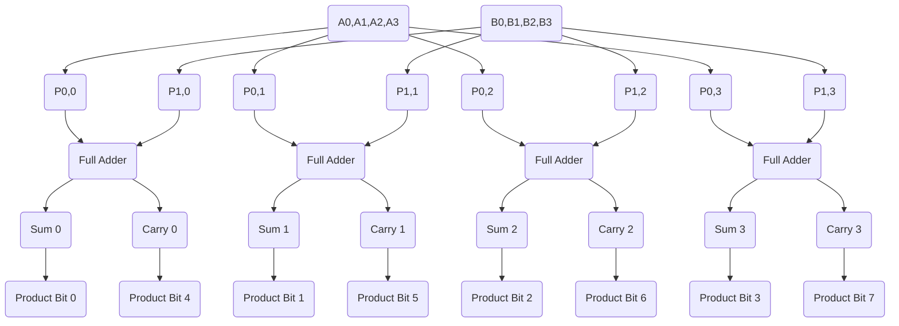

<!---

This file is used to generate your project datasheet. Please fill in the information below and delete any unused
sections.

You can also include images in this folder and reference them in the markdown. Each image must be less than
512 kb in size, and the combined size of all images must be less than 1 MB.
-->

## How it works

This project uses a 4x4 Array Multiplier to multiplies two four-bit numbers together, using a series of full adders to result in an 8 bit product. The multiplier works by systematically multiplying each bit of the first number with each bit of the second number. These partial products are then combined using a series of full adders to form the final result.

## How to test

Input two 4-bit binary numbers and manually verify the output.
For example:
1st num: 1001
2nd num: 1011
Output: 1100011 (binary), or 0x63 (hexadecimal)
The format of the output can be adjusted in test.py, but the value they represent should be accurate to the product of the two 4-bit binary numbers.
## External hardware
N/A
